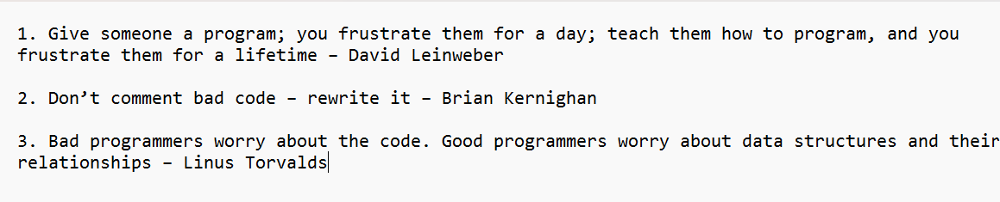
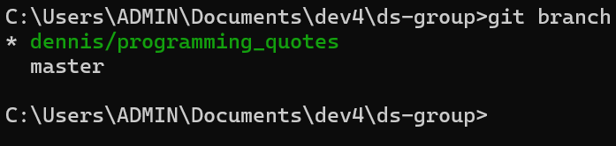
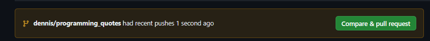
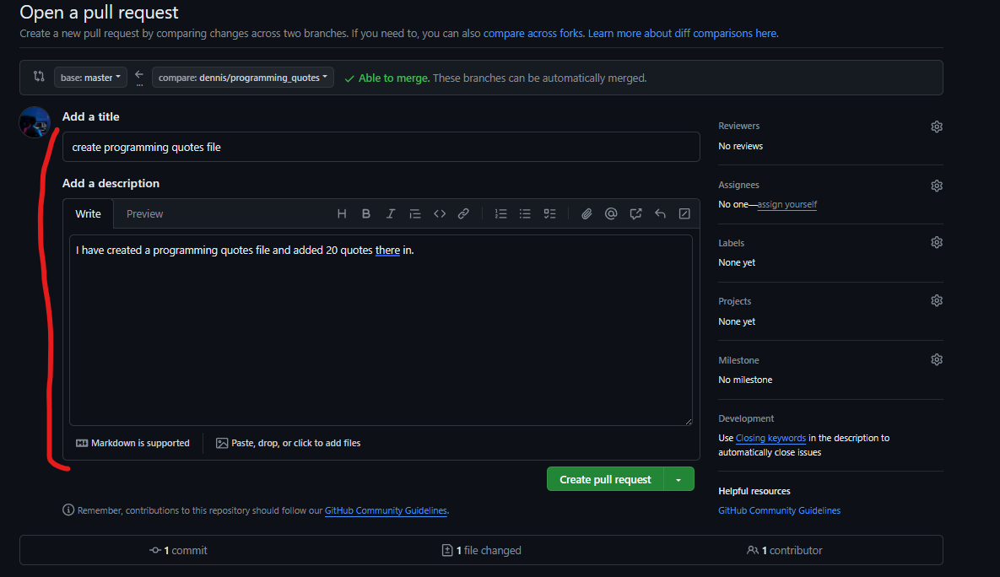
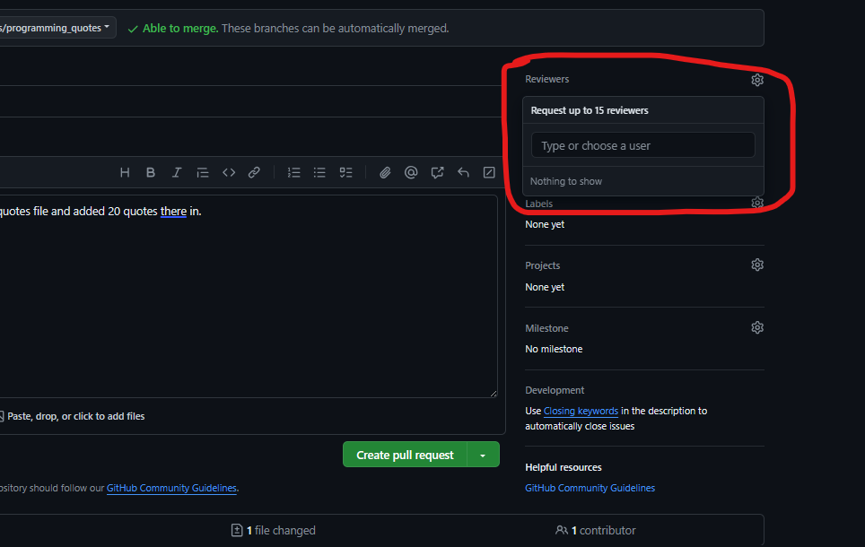

<!-- START doctoc generated TOC please keep comment here to allow auto update -->
<!-- DON'T EDIT THIS SECTION, INSTEAD RE-RUN doctoc TO UPDATE -->
**Table of Contents**

- [Programming Quotes](#programming-quotes)
  - [Introduction](#introduction)
  - [Step 1: Finding programming quotes](#step-1-finding-programming-quotes)
  - [Step 2: Save the quotes in a file.](#step-2-save-the-quotes-in-a-file)
  - [Step 3: Cloning the repository](#step-3-cloning-the-repository)
  - [Step 4: Create your branch](#step-4-create-your-branch)
  - [Step 5: Your Contribution!](#step-5-your-contribution)
  - [Step 6: Push changes to GitHub](#step-6-push-changes-to-github)
  - [Step 7: Create a pull request](#step-7-create-a-pull-request)
  - [Step 8: You are done!](#step-8-you-are-done)

<!-- END doctoc generated TOC please keep comment here to allow auto update -->

# Programming Quotes
## Introduction
This collaboration aims to provide you with hands-on experience in collaborating using Git and GitHub. Through this collaboration, you will learn how to contribute to a shared repository, create branches, push changes, create pull requests and collaborate effectively with your peers.   
We will be collecting greatest programming quotes of all times and putting them together, these quotes can be insightful, inspirational, humorous, or thought-provoking.

## Step 1: Finding programming quotes
To begin with, find 20 programming quotes from various sources such as books, articles, websites or even your own personal experiences. These quotes can be insightful, inspirational, humorous or motivational.

## Step 2: Save the quotes in a file.
Once you have collected your quotes, save them in a text file following the naming convention ```your-name_programming_quotes.txt```, for example if your name is dennis, your file will be ```dennis-otwoma_programming_quotes.txt```. Each quote should be on a new line in the text file for clarity. Make sure to mention the author as shown in the figure below and number your quotes.


## Step 3: Cloning the repository
Clone the project repository to your local machine. This allows you to have a local copy of the repository to work with.
1. Open Command Prompt or your terminal and navigate to where you want the project to live locally on your machine.
2. Run the command ```git clone <repository-url>``` where ```<repository-url>``` is the URL of our project repository on GitHub.

## Step 4: Create your branch
A branch is new/separate version of the main repository. It allows us to work on features, bug fixes, experimental features e.t.c without affecting the main repository/codebase until these changes are ready to be merged.  
It is a parallel version of a repository's main line of development.
1. For this collaboration, your branch name should look like ```your-name/programming_quotes```, for example, if your name is dennis, then your branch name will be ```dennis/programming_quotes```.
1. Navigate to the project directory using command prompt on windows or using your terminal in mac/linux.
1. Create a branch using the command ```git branch <branch-name>``` where ```<branch-name>``` is the name of your branch as guided above.
1. The step above creates a branch but does not switch to the branch. Now run the command ```git checkout <branch-name>``` where ```<branch-name>``` is the branch you created above.
1. You can confirm that you are actually in your branch using the command ```git branch```, the branch that you are currently in will have an asterisk symbol (*) to its left as shown below.


## Step 5: Your Contribution!
Now that we are in our own branch, we can do whatever we want. This won't affect the main project because we are in an "isolated environment". This isolation ensures that any modifications or additions we make are contained within our own branch and do not affect the stability or functionality of the main project/codebase. It allows us to work confidently knowing that our changes can be reviewed, tested, and integrated into the main project when they are ready.  
1. With this in mind, copy the file that contains your 20 programming projects into the working directory. Alternatively, you can create the file and name it using the guidelines provided earlier and write your quotes in it.

## Step 6: Push changes to GitHub
With your quotes saved and in your branch, it's time to push your changes to GitHub.  
1. Add the changes to the staging area using the command ```git add .```
1. Commit the changes to the repo using the command ```git commit -m <message>``` where ```<message>``` is a string describing what this change will do. For example ```git commit -m "add 10 quotes"```
1. Push the changes to GitHub using the command ```git push origin <branch-name>``` where ```<branch-name>``` is the name of your branch for example ```git push origin dennis/programming_quotes```

## Step 7: Create a pull request
A pull request (PR) is a mechanism used in version control systems like Git and GitHub to propose and discuss changes to a repository/project.
1. Once you have pushed your changes from local repo to GitHub, navigate to the repository on the GitHub website. You should see something like this:

Click on compare and pull request.
1. On the page you will be redirected to, provide a clear title and description for your pull request, summarizing the purpose of your changes.

1. To the right, click on reviewers and select a reviewer for the pull request.


## Step 8: You are done!
Your contribution will be reviewed and if there are any corrections you need to make you will be notified, if there are none, it will be merged.